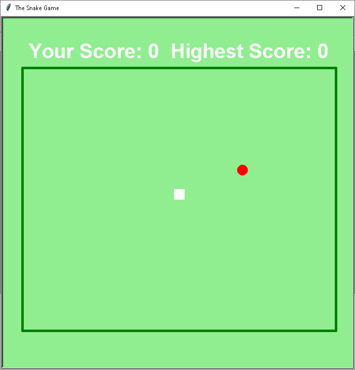

# Snake Game

Welcome to the Snake Game built in Python! This is a simple implementation of the classic Snake Game using Python's built-in libraries.

## Screenshots

Here are some screenshots of the game in action:

### Screenshot 1


### Screenshot 2


## How to Play

- Use the arrow keys to control the snake's movement.
- Eat the food (represented by the red square) to grow longer.
- Avoid hitting the walls or your own tail.

## Installation

1. Clone the repository:
    ```bash
    git clone https://github.com/Vikalp013/snake-game-python.git
    ```

2. Navigate to the project directory:
    ```bash
    cd Game
    ```

3. Run the game:
    ```bash
    python main.py
    ```

Enjoy playing the game!
